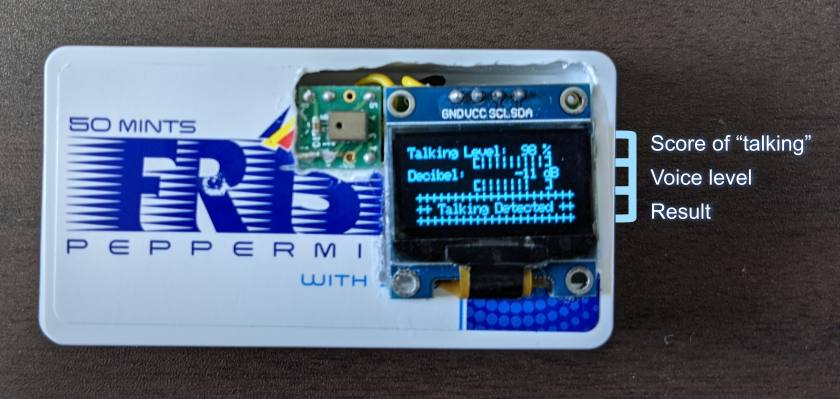
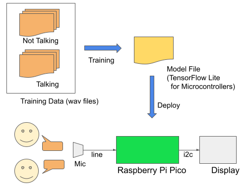
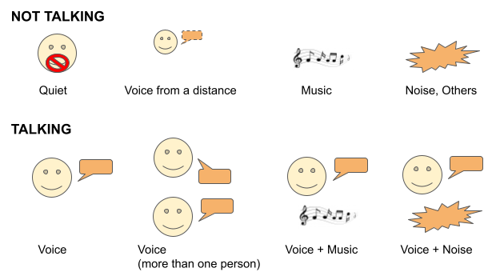
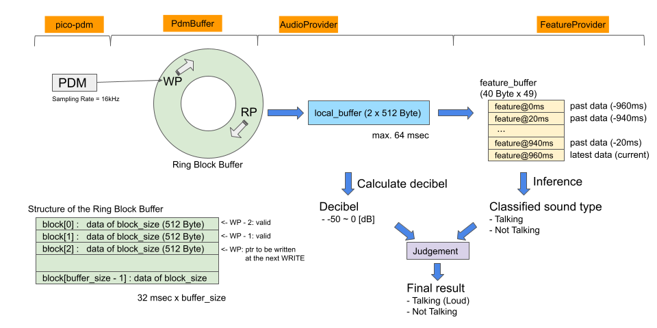
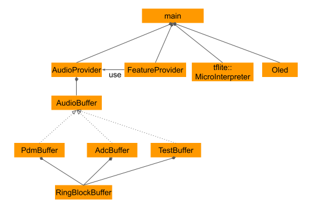

# Loud Talking Detector in FRISK
- This tinyML system uses Raspberry Pi Pico and TensorFlow Lite for Microcontrollers to detect loud talking, and encourages people in a restaurant/cafe to eat quietly to prevent the spread of the coronavirus ( COVID )
    - It detects "talking" when people talk loudly
    - It doesn't detect "talking" when people talk quietly or the sound is not talking ( e.g. noise, music, etc. )



## System overview
- Deep Learning Model
    - A deep learning model is created to classify 10 or 5 seconds of audio to two types of sound ("Talking", "Not Talking")
        - Change the value of `CLIP_DURATION ` and `kClipDuration` to switch clip duration (10sec/5sec)
    - The model is converted to TensorFlow Lite for Microcontrollers format
    - The training runs on Google Colaboratory
- Device
    - The model is deployed to a Raspberry Pi Pico
    - A microphone and a display are connected to the Raspberry Pi Pico
    - The Raspberry Pi Pico captures sound from the microphone, judges whether it's loud talking and outputs a result to the display



## Sound Category
- Not Talking:
    - Quiet
    - Voice from a distance
    - Music
    - Noise
    - Others
- Talking:
    - Voice
    - Voice (more than one person)
    - Voice + Music
    - Voice + Noise



## How to make
### Components
- Raspberry Pi Pico
- PDM microphone (SPM0405HD4H)
    - https://akizukidenshi.com/catalog/g/gM-05577/
- OLED (SSD1306, I2C, 128x64)
    - https://akizukidenshi.com/catalog/g/gP-15870/

### Connections
[00_doc/connections.txt](00_doc/connections.txt)

### How to build
```sh
git clone https://github.com/iwatake2222/pico-loud_talking_detector.git
cd pico-loud_talking_detector
git submodule update --init
cd pico-sdk && git submodule update --init && cd ..
mkdir build && cd build

# For Windows Visual Studio 2019 (Developer Command Prompt for VS 2019)
# cmake .. -G "NMake Makefiles" -DCMAKE_BUILD_TYPE=Debug -DPICO_DEOPTIMIZED_DEBUG=on
cmake .. -G "NMake Makefiles"
nmake

# For Windows MSYS2 (Run the following commands on MSYS2)
# cmake .. -G "MSYS Makefiles" -DCMAKE_BUILD_TYPE=Debug -DPICO_DEOPTIMIZED_DEBUG=on
cmake .. -G "MSYS Makefiles" 
make
```

### How to Create a Deep Learning Model
- Run the training script [01_script/training/train_micro_speech_model_talking_10sec.ipynb](01_script/training/train_micro_speech_model_talking_10sec.ipynb) on Google Colaboratory. It takes around 10 hours to train the model using GPU instance
- The original script is https://colab.research.google.com/github/tensorflow/tensorflow/blob/master/tensorflow/lite/micro/examples/micro_speech/train/train_micro_speech_model.ipynb . I made some modifications:
    - Use my dataset
    - Mix noise manually:
        1. Prepare original data: [Talking]
        2. Mix background: [Talking, Talking + Background]
        3. Mix noise: [Talking, Talking + Background, Talking + Noise, Talking + Background + Noise]
    - Separate test data from training data completely
        - Some clips are divided from the same video, so data leakage may happen if I randomly separate data following the original script
    - Change the wanted word list from [yes, no] to [talking, not_talking]
    - Remove "SILENCE" and "UNKNOWN" category
        - Because "SILENCE" and "UNKNOWN" are parts of "Not Talking"
    - Change clip duration from 1 sec to 10 sec
    - Increase training steps
- Note: you cannot run the script because data download will fail. I don't share dataset due to copyright.

### Dataset
- Details
    - Talking:
        - Talk show from YouTube
        - TV show
    - Not Talking:
        - https://research.google.com/audioset/dataset/index.html
        - Music from YouTube
    - Background (for augmentation and "Not Talking")
        - Restaurant / Coffee shop ambience
    - Noise (for augmentation and "Not Talking")
        - White noise, pink noise
- The number of data
    - 10-second-model
        - Talking: 22,144
        - Not Talking: 20,364
    - 5-second-model
        - Talking: 38,854
        - Not Talking: 36,557

## Software Design
Ths original project is from https://github.com/tensorflow/tensorflow/tree/master/tensorflow/lite/micro/examples/micro_speech .

### Dataflow


### Modules

- AudioBuffer:
    - provides an interface to access storead audio data in ring block buffer
    - has three implementations, ADC (for analog mic connected to ADC), PDM (for PDM mic), TestBuffer (prepared data array). I use PDM in this project
- RingBlockBuffer:
    - consists of some blocks. The block size is 512 Byte ~~and the size is equal to DMA's transfer size~~
    - 512 Byte ( 32 msec @16kHz ) is also convenient to work with FeatureProvider which generates feature data using 30 msec of audio data at 20 msec intervals
- AudioProvider:
    - extracts data from the ring block buffer to the local buffer for the requested time
    - converts data from uint8_t to int16_t if needed
    - allocates the data on sequential memory address
- FeatureProvider:
    - almost the same as the original code.
- Judgement:
    - judges whether the captured sound is "talking" using the following conditions:
        - current score of "talking" >= 0.8
        - average score of "talking" >= 0.6
        - amplitude >= -20 [dB]

## Performance
|                   | 10 sec model | 5 sec model |
| :---------------- | -----------: | ----------: |
| Accuracy          |   96.1 [%]   |  94.8 [%]   |
| Processing time   |    ---       |    ---      |
| __Total           |  554 [msec]  |  298 [msec] |
| __Preprocess      |   61 [msec]  |   31 [msec] |
| __Inference       |  455 [msec]  |  226 [msec] |
| __Other           |   38 [msec]  |   41 [msec] |
| Power consumption | 3.3 [V] x 21 [mA] | 3.3 [V] x 22 [mA] |

Note: Power consumption is measured without OLED (with OLED, it's around 26 [mA]).

## Future works


- This is a very tiny system (fittiing in FRISK !) , so that it can be implemented in an order call system in a restaurant to encourage customers to eat quietly to prevent the spread of the coronavirus
- Need to reduce power consumption
    - Current system continuously captures audio and runs inference. However, fast response is not so important for many cases. The frequency of inference can be decreased, probably once every several seconds or once a minute is enouhgh
    - Or using an analog circuilt to check voice level and kick pico in sleep mode may be a good idea
- Need to improve accuracy
    - So far, the training data is very limited and Japanese only

## Acknowledgements
- pico-sdk
	- https://github.com/raspberrypi/pico-sdk
	- Copyright (c) 2020 Raspberry Pi (Trading) Ltd.
- pico-tflmicro
	- https://github.com/raspberrypi/pico-tflmicro
	- Copyright 2019 The TensorFlow Authors. All Rights Reserved.
- pico-microphone
    - https://github.com/sandeepmistry/pico-microphone
    - Copyright (c) 2021 Arm Limited and Contributors. All rights reserved.
- Illustrations
    - https://www.irasutoya.com/
