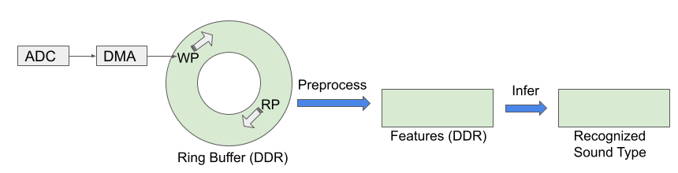

# Loud Talking Detector
- This system detects loud talking in an eating spot to help in the fight against COVID ( Corona Virus )
- This system can be implemented in a order call system

## System overview
- Training
	- A deep learning model is created using two (T.B.D.) types of sound data
	- The model is converted to TensorFlow Lite for Microcontrollers format
	- The training runs on a PC or on Google Colaboratory
- Production environment
	- The model is deployed to a Raspberry Pi Pico ( Raspi pico )
	- A microphone and a display are connected to the Raspi pico
	- The Raspi pico inputs sound from the microphone, judges whether it's loud talking and outputs a result to the display

## Category
- There are two types of sound category:
	- Not Talking:
		- Quiet
		- Voice from a distance
		- Music
		- Noise
		- Others
	- Talking:
		- Voice
		- Voice (more than one person)
		- Voice + Music
		- Voice + Noise

## How to Build and Run
### Components
todo

### Wiring
todo

### How to build
todo

### How to Run
todo

## How to Create a Deep Learning Model
todo

## Technology
### Dataflow

### Software Design
todo

## Acknowledgements
todo
